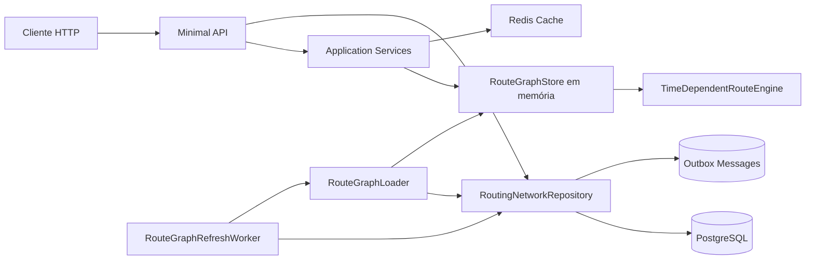

# RoutingService

Microserviço de roteirização logística desenvolvido em **.NET 8**. A API mantém uma malha de nós logísticos e lanes de transporte, carrega essa malha em memória como grafo, calcula opções de rota por janela de saída semanal e utiliza Redis para cachear pesquisas recentes.

## Sumário

- [Visão geral](#visão-geral)
- [Principais capacidades](#principais-capacidades)
- [Arquitetura](#arquitetura)
- [Stack técnica](#stack-técnica)
- [Modelo de domínio](#modelo-de-domínio)
- [Fluxo de roteirização](#fluxo-de-roteirização)
- [Pré-requisitos](#pré-requisitos)
- [Configuração](#configuração)
- [Executando localmente](#executando-localmente)
- [Banco de dados e persistência](#banco-de-dados-e-persistência)
- [API HTTP](#api-http)
- [Exemplos de uso](#exemplos-de-uso)
- [Cache, atualização do grafo e versionamento](#cache-atualização-do-grafo-e-versionamento)
- [Observabilidade e health check](#observabilidade-e-health-check)
- [Estrutura do projeto](#estrutura-do-projeto)
- [Testes e validações](#testes-e-validações)
- [Troubleshooting](#troubleshooting)
- [Roadmap sugerido](#roadmap-sugerido)

## Visão geral

O `RoutingService` resolve rotas entre um nó logístico de origem e uma região de destino identificada por CEP. A busca considera:

- cobertura postal associada aos nós de destino;
- lanes ativas da malha logística;
- janelas semanais de saída por lane;
- tempo de trânsito e tempo de handling do nó de destino;
- restrições de peso físico, peso cúbico, itens frágeis e itens restritos;
- versão atual da malha de roteamento;
- cache distribuído para reduzir recomputações.

A aplicação é exposta como **ASP.NET Core Minimal API** e organiza as responsabilidades em camadas simples: `Domain`, `Application`, `Graph`, `Infrastructure`, `Contracts` e `Api`.

## Principais capacidades

- **Consulta de rotas** por origem, CEP de destino e perfil de pacote.
- **Cadastro de nós logísticos** com região, fuso horário, tipo e tempo de handling.
- **Cadastro e manutenção de lanes** com transportadora, modal, capacidade, status e agenda de saídas.
- **Versionamento de rede** por região para invalidar snapshots e cache de forma controlada.
- **Grafo em memória** recarregado periodicamente a partir do PostgreSQL.
- **Cache Redis** com TTL curto para respostas de busca.
- **Outbox** para registrar eventos de alteração da malha logística.
- **Swagger/OpenAPI** habilitado em ambiente de desenvolvimento.
- **Health check** em `/health` com verificação do `DbContext`.

## Arquitetura



### Camadas

| Camada | Responsabilidade |
| --- | --- |
| `Api` | Define os endpoints HTTP e traduz exceções de domínio/aplicação em respostas HTTP. |
| `Contracts` | Contém os DTOs de entrada e saída da API. |
| `Application` | Orquestra busca de rotas, validações, chave de cache e algoritmo de cálculo. |
| `Graph` | Representa o snapshot imutável da malha e o armazenamento em memória. |
| `Domain` | Modela nós logísticos, lanes, agendas, cobertura postal, versão de rede e enums. |
| `Infrastructure` | Integra com PostgreSQL via EF Core, Redis, worker de refresh e outbox. |

## Stack técnica

- **.NET 8 / C#**
- **ASP.NET Core Minimal API**
- **Entity Framework Core 8**
- **Npgsql EF Core Provider** para PostgreSQL
- **Redis** via `Microsoft.Extensions.Caching.StackExchangeRedis`
- **Swagger** via `Swashbuckle.AspNetCore`
- **Health Checks** via `Microsoft.Extensions.Diagnostics.HealthChecks.EntityFrameworkCore`

## Modelo de domínio

### `LogisticsNode`

Representa um ponto da malha logística.

Campos principais:

- `Id`: identificador do nó.
- `Code`: código único normalizado em maiúsculas.
- `Name`: nome do nó.
- `Region`: região operacional.
- `TimeZoneId`: fuso horário usado para converter agendas locais em UTC.
- `Type`: tipo do nó (`FulfillmentCenter`, `CrossDocking`, `RegionalHub`, `SortationCenter`, `LastMileStation`).
- `HandlingMinutes`: tempo adicional de processamento ao chegar no nó.
- `IsActive`: indica se o nó participa da malha ativa.

### `LogisticsLane`

Representa uma conexão direcionada entre dois nós.

Campos principais:

- `OriginNodeId` e `DestinationNodeId`.
- `CarrierCode`: código da transportadora, normalizado em maiúsculas.
- `Mode`: modal (`Road`, `Air`, `Rail`, `InternalTransfer`, `LastMile`).
- `TransitMinutes`: tempo de trânsito da lane.
- `MaximumWeightKg` e `MaximumCubicWeightKg`.
- `SupportsFragileItems` e `SupportsRestrictedItems`.
- `Status`: `Active`, `Suspended`, `Maintenance` ou `Inactive`.
- `Version`: token de versão da lane.
- `Schedules`: saídas semanais associadas à lane.

### `LaneSchedule`

Define as janelas de saída de uma lane:

- `DayOfWeek`: dia da semana.
- `DepartureTime`: horário local de saída.
- `IsActive`: agenda ativa ou inativa.

### `PostalCoverage`

Mapeia intervalos de CEP para um nó de destino:

- `PostalCodeFrom` e `PostalCodeTo`: faixa numérica do CEP com 8 dígitos.
- `DestinationNodeId`: nó que atende a faixa.
- `Priority`: prioridade quando mais de uma cobertura atende o CEP.

> Observação: a API atual não possui endpoint público para criar `PostalCoverage`; os dados precisam ser inseridos diretamente no banco, por seed/migration ou processo administrativo externo.

### `NetworkVersion`

Controla a versão da malha por região. Alterações em nós e lanes incrementam a versão, permitindo que o worker identifique quando recarregar o grafo em memória.

## Fluxo de roteirização

1. O cliente chama `POST /routes/search` com origem, CEP de destino, pacote e data/hora desejada.
2. A aplicação valida origem, CEP e perfil do pacote.
3. O serviço lê o snapshot atual em memória (`RouteGraphStore`).
4. Uma chave de cache é criada com versão da malha, origem, CEP normalizado, atributos do pacote e minuto da solicitação.
5. Se houver resposta no Redis, a API retorna `Source = "Cache"`.
6. Caso contrário, o CEP é comparado com as faixas de cobertura postal do snapshot.
7. O algoritmo `TimeDependentRouteEngine` procura rotas viáveis considerando:
   - origem existente no grafo;
   - limite máximo de 6 pernas por rota;
   - capacidade de peso e peso cúbico;
   - suporte a item frágil/restrito;
   - próxima saída semanal disponível no fuso horário do nó de origem;
   - tempo de trânsito e handling no nó de destino.
8. A resposta é armazenada no Redis com TTL de 1 minuto e retornada com `Source = "Calculated"`.

## Pré-requisitos

- .NET SDK 8.x.
- PostgreSQL acessível pela aplicação.
- Redis acessível pela aplicação.
- Opcional: Visual Studio 2022 ou Rider.
- Opcional: `dotnet-ef` para criação/aplicação de migrations.

Instalação do `dotnet-ef`, se necessário:

```bash
dotnet tool install --global dotnet-ef
```

## Configuração

As configurações padrão ficam em `appsettings.json`:

```json
{
  "ConnectionStrings": {
    "RoutingDb": "Host=localhost;Database=routing;Username=postgres;Password=postgres",
    "Redis": "localhost:6379"
  },
  "Routing": {
    "Region": "Brasil Sudeste"
  }
}
```

### Variáveis de ambiente

Em ASP.NET Core, `:` pode ser substituído por `__` em variáveis de ambiente.

| Chave | Descrição | Exemplo |
| --- | --- | --- |
| `ConnectionStrings__RoutingDb` | String de conexão do PostgreSQL. | `Host=localhost;Database=routing;Username=postgres;Password=postgres` |
| `ConnectionStrings__Redis` | Endpoint do Redis. | `localhost:6379` |
| `Routing__Region` | Região da malha carregada no snapshot. | `Brasil Sudeste` |
| `ASPNETCORE_ENVIRONMENT` | Ambiente da aplicação. | `Development` |

Exemplo no Linux/macOS:

```bash
export ConnectionStrings__RoutingDb="Host=localhost;Database=routing;Username=postgres;Password=postgres"
export ConnectionStrings__Redis="localhost:6379"
export Routing__Region="Brasil Sudeste"
```

Exemplo no PowerShell:

```powershell
$Env:ConnectionStrings__RoutingDb = "Host=localhost;Database=routing;Username=postgres;Password=postgres"
$Env:ConnectionStrings__Redis = "localhost:6379"
$Env:Routing__Region = "Brasil Sudeste"
```

## Executando localmente

### 1. Restaurar dependências

```bash
dotnet restore RoutingService.sln
```

### 2. Compilar

```bash
dotnet build RoutingService.sln
```

### 3. Subir dependências externas

A aplicação espera PostgreSQL e Redis disponíveis. Caso use Docker localmente, um exemplo simples é:

```bash
docker run --name routing-postgres \
  -e POSTGRES_DB=routing \
  -e POSTGRES_USER=postgres \
  -e POSTGRES_PASSWORD=postgres \
  -p 5432:5432 \
  -d postgres:16

docker run --name routing-redis \
  -p 6379:6379 \
  -d redis:7
```

### 4. Preparar o banco

O repositório não contém migrations versionadas no momento. Para um ambiente local novo, gere e aplique uma migration inicial:

```bash
dotnet ef migrations add InitialCreate

dotnet ef database update
```

> Em ambientes controlados, prefira versionar as migrations geradas em um PR separado antes de promover para produção.

### 5. Executar a API

```bash
dotnet run --project RoutingService.csproj
```

Perfis configurados:

- HTTP: `http://localhost:5099`
- HTTPS: `https://localhost:7222`
- Swagger em desenvolvimento: `/swagger`

## Banco de dados e persistência

O `RoutingDbContext` mapeia as seguintes tabelas:

| Entidade | Tabela |
| --- | --- |
| `LogisticsNode` | `logistics_nodes` |
| `LogisticsLane` | `logistics_lanes` |
| `LaneSchedule` | `lane_schedules` |
| `PostalCoverage` | `postal_coverages` |
| `NetworkVersion` | `network_versions` |
| `OutboxMessage` | `outbox_messages` |

Pontos importantes:

- `logistics_nodes.code` possui índice único.
- Lanes possuem relacionamento com nó de origem e destino com deleção restrita.
- Agendas são removidas em cascata quando a lane é removida.
- Coberturas postais apontam para o nó de destino.
- Alterações de rede gravam mensagens na outbox com tipo `RoutingNetworkChanged`.

## API HTTP

### `GET /health`

Verifica a saúde da aplicação e do `RoutingDbContext`.

Resposta esperada em caso saudável:

```text
Healthy
```

### `POST /routes/search`

Busca opções de rota para um CEP de destino.

#### Request

```json
{
  "originNodeId": "00000000-0000-0000-0000-000000000000",
  "destinationPostalCode": "01310-100",
  "package": {
    "weightKg": 2.5,
    "cubicWeightKg": 3.1,
    "isFragile": false,
    "isRestricted": false
  },
  "requestedAtUtc": "2026-06-10T12:00:00Z",
  "maxOptions": 3
}
```

#### Regras

- `originNodeId` é obrigatório e não pode ser `Guid.Empty`.
- `destinationPostalCode` deve conter 8 dígitos após normalização.
- `package.weightKg` deve ser maior que zero.
- `package.cubicWeightKg` não pode ser negativo.
- `maxOptions` é limitado entre 1 e 5 pela aplicação.

#### Response `200 OK`

```json
{
  "networkVersion": 2,
  "source": "Calculated",
  "routes": [
    {
      "routeId": "route_4f1b2c3d4e5f678901234567",
      "originNodeId": "11111111-1111-1111-1111-111111111111",
      "destinationNodeId": "22222222-2222-2222-2222-222222222222",
      "estimatedDepartureAt": "2026-06-10T13:00:00+00:00",
      "estimatedArrivalAt": "2026-06-10T18:30:00+00:00",
      "totalElapsedMinutes": 390,
      "legs": [
        {
          "laneId": "33333333-3333-3333-3333-333333333333",
          "originNodeId": "11111111-1111-1111-1111-111111111111",
          "originCode": "FC-SP",
          "destinationNodeId": "22222222-2222-2222-2222-222222222222",
          "destinationCode": "LM-SP-01",
          "carrierCode": "CARRIER-01",
          "mode": "Road",
          "departureAt": "2026-06-10T13:00:00+00:00",
          "arrivalAt": "2026-06-10T18:30:00+00:00",
          "transitMinutes": 300
        }
      ]
    }
  ]
}
```

#### Possíveis erros

| Status | Cenário |
| --- | --- |
| `400 Bad Request` | Dados inválidos, como CEP inválido, pacote inválido ou origem vazia. |
| `503 Service Unavailable` | Grafo ainda não foi carregado. Aguarde o worker ou chame `/network/reload`. |

### `POST /network/nodes`

Cria um nó logístico e incrementa a versão da rede da região informada.

#### Request

```json
{
  "code": "FC-SP",
  "name": "Fulfillment Center São Paulo",
  "region": "Brasil Sudeste",
  "timeZoneId": "E. South America Standard Time",
  "type": "FulfillmentCenter",
  "handlingMinutes": 30
}
```

> Em Linux, IDs IANA como `America/Sao_Paulo` costumam estar disponíveis. Em Windows, IDs como `E. South America Standard Time` são comuns. Use um identificador suportado pelo sistema operacional onde a aplicação roda.

#### Response `201 Created`

Retorna o nó criado.

### `POST /network/lanes`

Cria uma lane entre dois nós existentes.

#### Request

```json
{
  "originNodeId": "11111111-1111-1111-1111-111111111111",
  "destinationNodeId": "22222222-2222-2222-2222-222222222222",
  "carrierCode": "carrier-01",
  "mode": "Road",
  "transitMinutes": 300,
  "maximumWeightKg": 30,
  "maximumCubicWeightKg": 50,
  "supportsFragileItems": true,
  "supportsRestrictedItems": false,
  "region": "Brasil Sudeste",
  "schedules": [
    {
      "dayOfWeek": "Monday",
      "departureTime": "08:00:00",
      "isActive": true
    },
    {
      "dayOfWeek": "Wednesday",
      "departureTime": "14:00:00",
      "isActive": true
    }
  ]
}
```

#### Response `201 Created`

Retorna a lane criada.

### `PUT /network/lanes/{laneId}`

Atualiza dados operacionais da lane e substitui suas agendas.

#### Request

```json
{
  "transitMinutes": 280,
  "maximumWeightKg": 35,
  "maximumCubicWeightKg": 55,
  "supportsFragileItems": true,
  "supportsRestrictedItems": true,
  "region": "Brasil Sudeste",
  "schedules": [
    {
      "dayOfWeek": "Tuesday",
      "departureTime": "09:30:00",
      "isActive": true
    }
  ]
}
```

### `PATCH /network/lanes/{laneId}/status`

Altera o status de uma lane.

#### Request

```json
{
  "status": "Suspended",
  "region": "Brasil Sudeste"
}
```

Valores possíveis de `status`:

- `Active`
- `Suspended`
- `Maintenance`
- `Inactive`

### `GET /network/version?region=Brasil%20Sudeste`

Consulta a versão atual da rede e o estado do grafo em memória.

#### Response `200 OK`

```json
{
  "region": "Brasil Sudeste",
  "version": 2,
  "updatedAt": "2026-06-10T12:00:00+00:00",
  "isGraphLoaded": true,
  "loadedAt": "2026-06-10T12:00:10+00:00"
}
```

Se `region` não for enviada, a API usa `Routing:Region` e, como fallback, `Brasil Sudeste`.

### `POST /network/reload`

Força o recarregamento do grafo em memória a partir do banco.

#### Response `200 OK`

```json
{
  "version": 2,
  "loadedAt": "2026-06-10T12:00:10+00:00",
  "nodeCount": 10,
  "laneCount": 18,
  "coverageCount": 5
}
```

## Exemplos de uso

### Criar um nó de origem

```bash
curl -X POST http://localhost:5099/network/nodes \
  -H "Content-Type: application/json" \
  -d '{
    "code": "FC-SP",
    "name": "Fulfillment Center São Paulo",
    "region": "Brasil Sudeste",
    "timeZoneId": "America/Sao_Paulo",
    "type": "FulfillmentCenter",
    "handlingMinutes": 20
  }'
```

### Criar um nó de destino

```bash
curl -X POST http://localhost:5099/network/nodes \
  -H "Content-Type: application/json" \
  -d '{
    "code": "LM-SP-01",
    "name": "Estação Last Mile SP 01",
    "region": "Brasil Sudeste",
    "timeZoneId": "America/Sao_Paulo",
    "type": "LastMileStation",
    "handlingMinutes": 30
  }'
```

### Criar uma lane

Substitua os GUIDs pelos IDs retornados nos cadastros dos nós.

```bash
curl -X POST http://localhost:5099/network/lanes \
  -H "Content-Type: application/json" \
  -d '{
    "originNodeId": "11111111-1111-1111-1111-111111111111",
    "destinationNodeId": "22222222-2222-2222-2222-222222222222",
    "carrierCode": "CARRIER-01",
    "mode": "Road",
    "transitMinutes": 300,
    "maximumWeightKg": 30,
    "maximumCubicWeightKg": 50,
    "supportsFragileItems": true,
    "supportsRestrictedItems": false,
    "region": "Brasil Sudeste",
    "schedules": [
      {
        "dayOfWeek": "Monday",
        "departureTime": "08:00:00",
        "isActive": true
      }
    ]
  }'
```

### Inserir cobertura postal

Como não há endpoint público para `PostalCoverage`, insira a cobertura diretamente no banco ou por seed/migration. Exemplo SQL ilustrativo:

```sql
insert into postal_coverages
  (id, destination_node_id, postal_code_from, postal_code_to, priority)
values
  (gen_random_uuid(), '22222222-2222-2222-2222-222222222222', 01000000, 05999999, 1);
```

### Recarregar o grafo

```bash
curl -X POST http://localhost:5099/network/reload
```

### Buscar rotas

```bash
curl -X POST http://localhost:5099/routes/search \
  -H "Content-Type: application/json" \
  -d '{
    "originNodeId": "11111111-1111-1111-1111-111111111111",
    "destinationPostalCode": "01310-100",
    "package": {
      "weightKg": 2.5,
      "cubicWeightKg": 3.1,
      "isFragile": false,
      "isRestricted": false
    },
    "requestedAtUtc": "2026-06-10T12:00:00Z",
    "maxOptions": 3
  }'
```

## Cache, atualização do grafo e versionamento

### Cache de busca

- Implementação: `RedisRouteSearchCache`.
- TTL atual: 1 minuto.
- Prefixo de instância Redis: `routing:`.
- A chave inclui a versão da rede, origem, CEP, características do pacote e minuto da solicitação.
- Respostas vindas do cache retornam `source = "Cache"`; respostas calculadas retornam `source = "Calculated"`.

### Snapshot do grafo

O grafo é carregado por região e contém:

- dicionário de nós;
- adjacency list das lanes ativas;
- coberturas postais;
- versão da rede;
- data/hora de carregamento.

### Worker de refresh

O `RouteGraphRefreshWorker` executa na inicialização e depois a cada 15 segundos. Ele compara a versão carregada no `RouteGraphStore` com a versão persistida no banco. Quando há divergência, recarrega o snapshot.

## Observabilidade e health check

- Logs seguem a configuração padrão de `Logging` do ASP.NET Core.
- Endpoint de saúde: `GET /health`.
- Swagger em desenvolvimento: `/swagger`.
- Erros inesperados passam pelo middleware `UseExceptionHandler`.

## Estrutura do projeto

```text
.
├── Api/
│   └── RoutingEndpoints.cs
├── Application/
│   ├── Ports/
│   ├── CalculatedRoute.cs
│   ├── RouteCacheKeyFactory.cs
│   ├── RouteSearchService.cs
│   └── TimeDependentRouteEngine.cs
├── Contracts/
│   ├── NetworkRequests.cs
│   ├── SearchRoutesRequest.cs
│   └── SearchRoutesResponse.cs
├── Domain/
│   ├── Enums.cs
│   ├── LaneSchedule.cs
│   ├── LogisticsLane.cs
│   ├── LogisticsNode.cs
│   ├── NetworkVersion.cs
│   └── PostalCoverage.cs
├── Graph/
│   ├── RouteGraphLoader.cs
│   ├── RouteGraphSnapshot.cs
│   └── RouteGraphStore.cs
├── Infrastructure/
│   ├── Cache/
│   ├── Outbox/
│   ├── Persistence/
│   └── Workers/
├── Program.cs
├── RoutingService.csproj
├── RoutingService.sln
├── appsettings.json
└── README.md
```

## Testes e validações

No estado atual do repositório não há projeto de testes automatizados. Ainda assim, os comandos abaixo são úteis para validação local:

```bash
dotnet restore RoutingService.sln
```

```bash
dotnet build RoutingService.sln
```

Se um projeto de testes for adicionado futuramente:

```bash
dotnet test RoutingService.sln
```

## Troubleshooting

### `Routing graph has not been loaded`

Causa provável: o worker ainda não conseguiu carregar a malha ou o banco não possui dados/versionamento para a região configurada.

Ações recomendadas:

1. Verifique `ConnectionStrings__RoutingDb`.
2. Confirme se existe registro em `network_versions` para a região.
3. Confirme se há nós, lanes ativas e coberturas postais.
4. Execute `POST /network/reload`.
5. Consulte `GET /network/version`.

### Busca retorna lista vazia

Causas comuns:

- CEP não está coberto por nenhum intervalo em `postal_coverages`.
- Origem não possui caminho até o nó de destino.
- Lanes estão suspensas, em manutenção ou inativas.
- Pacote excede limites de peso/peso cúbico.
- Pacote é frágil/restrito, mas as lanes não dão suporte.
- Não existe saída semanal compatível nos próximos 7 dias.

### Erro de fuso horário

O algoritmo usa `TimeZoneInfo.FindSystemTimeZoneById`. Garanta que `timeZoneId` dos nós exista no sistema operacional do ambiente de execução.

### Redis indisponível

A busca depende da implementação de cache distribuído. Verifique:

- host/porta em `ConnectionStrings__Redis`;
- disponibilidade do container/serviço Redis;
- logs da aplicação.

### PostgreSQL indisponível

Verifique:

- host, porta, usuário, senha e database da string de conexão;
- se o schema foi criado;
- se o usuário possui permissões no banco.

## Roadmap sugerido

- Adicionar migrations versionadas ao repositório.
- Criar endpoint administrativo ou seed para `PostalCoverage`.
- Adicionar testes unitários para `TimeDependentRouteEngine` e `RouteSearchService`.
- Adicionar testes de integração para os endpoints.
- Implementar processamento real da outbox.
- Adicionar autenticação/autorização para endpoints administrativos de rede.
- Publicar `docker-compose.yml` para PostgreSQL, Redis e API.
- Adicionar CI com restore, build, testes e análise estática.
- Documentar política de observabilidade com métricas e tracing distribuído.
